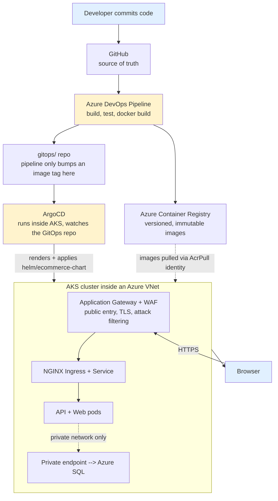

# E-Commerce DevOps Lab

A hands-on, production-grade practice project: a real .NET 8 + Angular 17 e-commerce application, taken all the way from `docker build` on a laptop to a GitOps-driven deployment on Azure Kubernetes Service, behind a VNet, private endpoints, and a Web Application Firewall.

This repo is deliberately **two things at once**: a working application, and a **teaching artifact**. Every file — every Dockerfile line, every Kubernetes field, every Terraform resource, every pipeline stage — is commented to explain not just *what* it does but *why* it exists. The `docs/` folder goes even deeper, in plain-English lessons written for someone learning DevOps from the ground up.

## What's inside

```
ecommerce-devops-lab/
├── backend/                  .NET 8 Web API — products, categories, orders, JWT auth, EF Core + SQL Server
├── frontend/                 Angular 17 storefront — catalog, cart, login, orders, runtime-configurable API URL
├── docker-compose.yml        Run the whole stack locally with one command
├── k8s/                      Raw Kubernetes manifests, Kustomize base + dev/prod overlays
├── helm/ecommerce-chart/     The same app packaged as a versioned, templated Helm chart
├── gitops/                   Per-environment values that ArgoCD watches (simulates a separate GitOps repo)
├── argocd/                   ArgoCD Application/AppProject manifests — the app-of-apps bootstrap
├── terraform/                Azure infrastructure as code: VNet/subnets/NSG/NAT, ACR, AKS, App Gateway + WAF
├── .azuredevops/             Multi-stage Azure DevOps CI pipeline (build → test → push to ACR → update GitOps repo)
└── docs/                     15 in-depth lessons — read these in order, start to finish
```

## How the pieces fit together



CI (Azure DevOps) and CD (ArgoCD) are deliberately decoupled: the pipeline never touches the cluster directly. It builds, tests, pushes images to ACR, and commits a new image tag to the GitOps repo. ArgoCD — running inside the cluster, watching that repo — is the only thing that ever applies changes to AKS. `docs/01-architecture-overview.md` and `docs/08-gitops-argocd.md` explain exactly why this split exists.

## Learning path — read `docs/` in this order

| # | Doc | Covers |
|---|-----|--------|
| 01 | `01-architecture-overview.md` | The big picture, before any individual file |
| 02 | `02-dotnet-backend.md` | ASP.NET Core 8: DI, EF Core, migrations, JWT auth, health checks |
| 03 | `03-angular-frontend.md` | Angular 17: routing, guards, signals, the runtime-config `env.js` trick |
| 04 | `04-docker-deep-dive.md` | Containers, multi-stage builds, layer caching, non-root users |
| 05 | `05-docker-compose.md` | Running the full stack locally with one command |
| 06 | `06-kubernetes-fundamentals.md` | Pods, Deployments, Services, Secrets, StatefulSets, probes, HPA, Kustomize |
| 07 | `07-helm-charts.md` | Packaging the app as a reusable, versioned Helm chart |
| 08 | `08-gitops-argocd.md` | Pull-based deployment, ArgoCD, the app-of-apps pattern |
| 09 | `09-terraform-iac.md` | Infrastructure as code: modules, state, plan/apply |
| 10 | `10-azure-networking.md` | VNet, subnets, NSGs, NAT Gateway, private endpoints, load balancers, WAF |
| 11 | `11-azure-container-registry.md` | Private image storage, tagging, keyless AKS→ACR auth |
| 12 | `12-aks-cluster.md` | Managed Kubernetes, node pools, private clusters, autoscaling |
| 13 | `13-azure-devops-pipeline.md` | The real CI pipeline, stage by stage |
| 14 | `14-github-workflow.md` | Branching strategy, PRs, how GitHub and Azure DevOps combine |
| 15 | `15-end-to-end-runbook.md` | Hands-on lab: local → kind/minikube → real Azure, plus troubleshooting |

## Quick start (local, free)

```bash
cp .env.example .env        # edit SA_PASSWORD and JWT_KEY
docker compose up --build
# API:      http://localhost:5000/swagger
# Frontend: http://localhost:4200
```

Full instructions — including practicing Kubernetes and ArgoCD locally with `kind`, and eventually applying the Terraform against a real Azure subscription — are in `docs/15-end-to-end-runbook.md`.

## A note on scope

This project is sized to be **learnable**, not enterprise-scale. The application has a handful of entities (Products, Categories, Orders, Users) — enough to need real config, secrets, migrations, and multiple services, but not so much that the DevOps tooling gets lost in business logic. The Terraform is real, ready-to-run code, but it is **not applied** in this environment — no Azure credentials were used here, and applying it against your own subscription will incur Azure costs. Read `docs/09-terraform-iac.md` and `docs/15-end-to-end-runbook.md` before running `terraform apply` for real.
