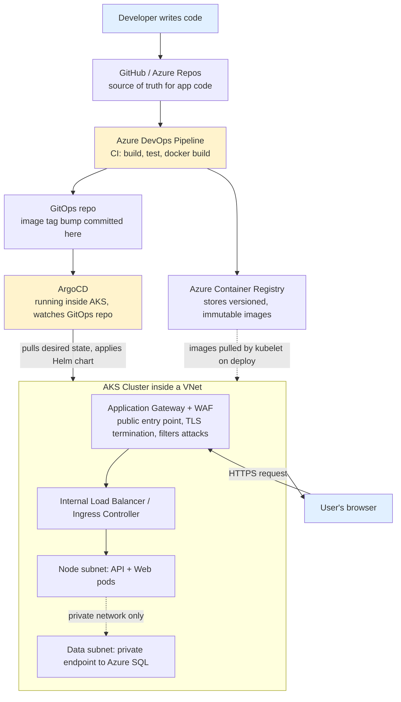

# 01 — Architecture Overview

## Why this document exists

Before you look at a single Dockerfile or YAML manifest, you need a mental map of the whole system. Without that map, every individual file you read later ("why does this Service have to be named `ecommerce-api`?", "why does the pipeline never call `kubectl`?") will feel like an arbitrary rule to memorize instead of a deliberate answer to a real problem. This document builds that map. Every later document (02 through 15) zooms into one box on the diagram below; this one explains why the boxes exist and how they connect.

The project you're working through is a small but real e-commerce application: a .NET 8 Web API backend and an Angular 17 frontend, backed by SQL Server. The application code itself is intentionally simple — products, categories, a cart, orders, login. What makes this a "DevOps" project rather than just "an app" is everything *around* that code: how it gets built, tested, packaged, shipped, run, scaled, secured, and recovered, reliably and repeatedly, without a human manually SSHing into a server. That surrounding machinery is what the rest of these docs teach.

## What "production-grade" actually means

"Production-grade" is not a single feature — it's a collection of properties that only matter once real users, real money, or real uptime expectations are involved. Concretely, in this project, it means: the same artifact that was tested is the one that ships (no "works on my machine" rebuilds between environments); a bad change can be rolled back in seconds, not by remembering what you changed; secrets never live in source control; the system heals itself when a process crashes and protects itself when a dependency is slow, rather than cascading into a full outage; capacity grows and shrinks with real load instead of being sized once and left alone; and every change to what's running in production is visible in a Git history, not buried in someone's terminal scrollback. Each tool in this stack exists to guarantee one or more of those properties. None of them exist "because that's what enterprises do" — each one is a direct answer to a specific failure mode that simpler setups run into as soon as more than one person or more than one environment is involved.

## The tools, and the problems they solve

**Docker** solves the "works on my machine" problem at its root. A container packages the application together with its exact runtime, libraries, and OS-level dependencies into a single portable image, so "the code" and "the environment it runs in" travel together as one unit. Once you have that image, the question "does this run correctly?" has the same answer on a developer's laptop, in CI, and on a production node, because it's *literally the same filesystem and runtime* running each time — not a fresh install that might drift. Doc 04 covers this in depth.

**Docker Compose** solves local orchestration for multiple containers. A real app is never just one container — this one needs a database, an API, and a web frontend running together, talking to each other by name, started in the right order. Compose lets you describe that whole topology in one YAML file and bring it up with one command, instead of hand-typing a growing pile of `docker run` flags every time. Doc 05 covers this.

**Kubernetes (K8s)** solves the problem Compose does *not* solve: running containers reliably across a fleet of machines, not one laptop. Kubernetes restarts crashed containers, spreads replicas across nodes, only sends traffic to instances that are actually healthy, and gives you a declarative API ("I want 3 replicas of this image with these resource limits") that a controller continuously reconciles against reality. Doc 06 covers this.

**Helm** solves the problem of raw Kubernetes YAML not being reusable. Writing one static YAML file per environment means copy-pasting near-duplicate manifests and hoping you remember to change every place a value differs. Helm turns a set of Kubernetes manifests into a templated, versioned package (a "chart") with one values file per environment, so promoting to a new environment means changing values, not rewriting YAML. Doc 07 covers this. (Doc 06 also covers Kustomize, a different, template-free answer to the same "environment differences" problem — this project deliberately shows both so you can compare them directly.)

**GitOps and ArgoCD** solve the problem of "who or what is allowed to change production, and how do we know what's actually running?" Instead of a CI pipeline directly running `kubectl apply` or `helm upgrade` against the cluster (a *push* model, where the pipeline needs cluster credentials and the cluster's true desired state lives only in pipeline logs), GitOps makes a Git repository the single source of truth for "what should be running." ArgoCD runs *inside* the cluster and continuously *pulls* from that Git repo, comparing it to live cluster state and reconciling any drift. Doc 08 covers this, and the "why pull, not push" reasoning is central to it.

**Terraform** solves the problem of manually clicking through the Azure Portal to create infrastructure (a virtual network, an AKS cluster, a container registry) — a process that isn't repeatable, isn't reviewable, and leaves no record of *why* something was configured a certain way. Terraform lets you declare that infrastructure as code, plan changes before applying them, and version the plan in Git exactly like application code. Doc 09 covers this.

**Azure networking** (VNets, subnets, Application Gateway with a Web Application Firewall, private endpoints) solves the problem of a Kubernetes cluster and its database being reachable only where they should be reachable — not wide open to the internet. Doc 10 covers this.

**CI/CD** (the Azure DevOps pipeline) solves the problem of manually running build and test commands, and manually deciding when code is "good enough" to ship. Docs 11–12 cover this, including exactly where CI's job stops and GitOps's job begins.

## The throughline: from a developer's keystroke to a user's browser

The diagram below traces one continuous path: a developer commits code, and — through a chain of specific, separately-owned systems — that change eventually becomes bytes rendered in a user's browser.

Walking through every hop by name: a developer pushes a commit to the Git repository holding the application source (`backend/`, `frontend/`). That push triggers the Azure DevOps Pipeline defined in `.azuredevops/azure-pipelines.yml`, which restores dependencies, runs tests, builds the Docker images for the API and the web frontend, and pushes those images — tagged immutably with the build ID, never with a mutable tag like `latest` — to Azure Container Registry (ACR). ACR is a private, versioned store of every image the project has ever built; it is *not* a place code changes are deployed from directly.

Here is the hinge point of the whole architecture: the pipeline's very last action is not to deploy anything. It commits a small change — bumping an image tag — into a separate **GitOps repository** (`gitops/apps/ecommerce-dev/values.yaml` or `.../ecommerce-prod/values.yaml` in this project). The pipeline never runs `kubectl` or `helm upgrade` against the cluster, and it holds no credentials that could. Instead, **ArgoCD**, a controller running permanently inside the AKS cluster, is separately watching that GitOps repository. When it notices the repo's desired state no longer matches what's actually running in the cluster, it pulls the new state and reconciles the difference itself — rendering the Helm chart in `helm/ecommerce-chart/` with the updated values and applying the result.

Once ArgoCD has applied the change, the new pods are scheduled inside AKS, itself running inside an Azure Virtual Network (VNet) carved into subnets — one for the running application nodes, another isolated one where a private endpoint reaches the managed Azure SQL Database, never exposed to the public internet. All external traffic enters through an Application Gateway with a Web Application Firewall (AGW+WAF) attached, which terminates TLS and filters malicious requests before anything reaches the cluster's internal load balancer / ingress controller, which in turn routes the request to the correct Kubernetes Service and finally a pod. The response travels back out the same path to the user's browser.

## Why split CI and CD at all — the GitOps decoupling

It's worth pausing on *why* the pipeline stops at "commit to the GitOps repo" instead of finishing the job with a `kubectl apply`. If you've only seen simpler setups, this split can look like unnecessary indirection. It solves three concrete problems. First, credentials: a pipeline that can directly deploy to production needs long-lived cluster-admin credentials sitting in CI configuration — a large, tempting attack surface. A pipeline that only pushes images and commits to Git needs no cluster access at all; only ArgoCD, running inside the cluster's own trust boundary, needs (and has) that access. Second, drift and truth: if deployment happens by a pipeline imperatively running commands, the only record of "what's actually running right now" is scattered across pipeline run logs. With GitOps, the answer to "what's running in production" is always "whatever the GitOps repo says," because ArgoCD continuously enforces that the cluster matches it — including self-healing if someone manually changes something in the cluster out-of-band. Third, and most practically for this project: it lets CI and CD fail, retry, and be reasoned about completely independently. A flaky test runner or a broken pipeline agent has zero ability to touch what's running in production; and a cluster networking blip has zero effect on whether new images keep building successfully. CI answers "is this code good?" CD (via ArgoCD) answers "does the cluster match Git?" — two different questions, two different systems, on purpose.

## How to read the rest of these docs

Each remaining document goes deep on one layer of the diagram above, using the real files in this project as worked examples rather than generic theory. Read them in this order:

- **02-dotnet-backend.md** — the ASP.NET Core 8 Web API itself: minimal hosting, dependency injection, EF Core migrations, JWT auth, CORS, and the `/health` vs `/health/live` distinction that Kubernetes probes depend on later.
- **03-angular-frontend.md** — the Angular 17 standalone frontend: routing, guards, services, interceptors, and the runtime-config (`env.js`) trick that lets one built image work in every environment.
- **04-docker-deep-dive.md** — what a container actually is, multi-stage builds, layer caching, non-root users, and base image choices, using both project Dockerfiles.
- **05-docker-compose.md** — orchestrating the database, API, and web containers together locally with one command.
- **06-kubernetes-fundamentals.md** — Pods, Deployments, Services, ConfigMaps/Secrets, StatefulSets, Ingress, probes, autoscaling, and Kustomize overlays, using the real `k8s/` manifests.
- **07-helm-charts.md** — templating the same application as a reusable, versioned Helm chart, and how it differs from Kustomize.
- **08-gitops-argocd.md** — the pull-based deployment model: how ArgoCD watches the GitOps repo and reconciles the cluster.
- **09-terraform-iac.md** — provisioning AKS, ACR, networking, and the App Gateway as code, and how Terraform's plan/apply/state model works.
- **10-azure-networking.md** — VNets, subnets, NSGs, NAT Gateway, private endpoints, and the AGW+WAF entry point in detail.
- **11-azure-container-registry.md** — ACR itself: private image storage, tagging strategy, and how AKS pulls images without embedded credentials.
- **12-aks-cluster.md** — AKS as managed Kubernetes: node pools, networking modes, private clusters, and how the cluster autoscaler relates to the HPA from doc 06.
- **13-azure-devops-pipeline.md** — the Azure DevOps pipeline stages: build, test, image push, and exactly where its job stops and GitOps takes over.
- **14-github-workflow.md** — branching strategy, PR flow, and how GitHub and Azure DevOps fit together.
- **15-end-to-end-runbook.md** — a practical, phase-by-phase lab guide: run it locally, then on kind/minikube, then on real Azure — plus a troubleshooting table.

## Key terms

- **Artifact**: a built, immutable output of a build process — here, a Docker image tagged with a specific build ID — that is promoted between environments without being rebuilt.
- **Reconciliation**: the process by which a controller (Kubernetes itself, or ArgoCD) continuously compares desired state to actual state and takes action to close any gap.
- **Push vs. pull deployment**: push means an external system (a CI pipeline) initiates changes to the cluster; pull means an agent inside the cluster (ArgoCD) fetches and applies changes on its own schedule/trigger.
- **Source of truth**: the single place a fact is authoritative — for "what code is running," that's the GitOps repo, not any pipeline log or person's memory.
- **Control plane / data plane**: the control plane (e.g., the Kubernetes API server, ArgoCD) makes decisions about desired state; the data plane (the actual pods serving t